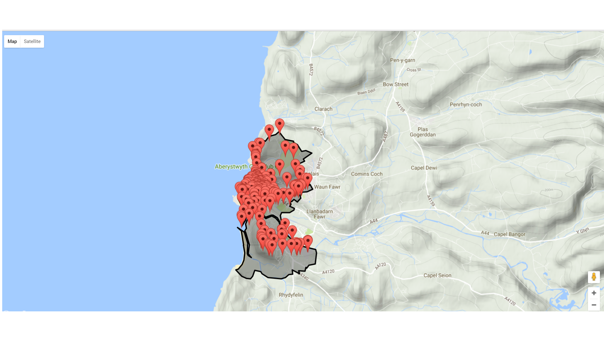
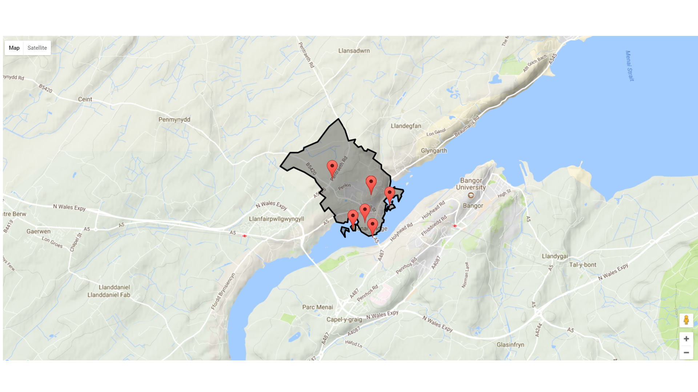

# Solr Spatial Search (geoJson) of places in Wales|Cymru

Simplified polylines of authorities, communities and electoral wards in Wales for performing spatial searches in Solr.

All geoJson comes from [statistics.data.gov.uk](http://statistics.data.gov.uk/resource?uri=http%3A%2F%2Fstatistics.data.gov.uk%2Fid%2Fstatistical-geography%2FW92000004).

## Example spatial search of Aberystwyth


## Example spatial search of Menai Bridge


Search data from [peoplescollection.wales](https://www.peoplescollection.wales).

## Location data

[all_wales.json](places/all_wales.json) contains the location information from all the places in Wales (from [statistics.data.gov.uk](http://statistics.data.gov.uk/resource?uri=http%3A%2F%2Fstatistics.data.gov.uk%2Fid%2Fstatistical-geography%2FW92000004)).

[places/authorities](places/authorities) - geoJSON of authorities in Wales.

[places/communities](places/communities) - geoJSON of communities in Wales.

[places/electoral_wards](places/electoral_wards) - geoJSON of electoral wards in Wales.

[places/poly_line_json](places/poly_line_json) - Simplified polylines of geoJSON places in Wales, used to perform polygon search in Solr. See [get.php](get.php) for example Solr request.


## Solr schema

```xml
<field name="location_rpt_two_geo" type="location_rpt_two" indexed="true" stored="true" />
```

```xml
<fieldType name="location_rpt_two"   class="solr.SpatialRecursivePrefixTreeFieldType"
               spatialContextFactory="com.spatial4j.core.context.jts.JtsSpatialContextFactory"
               autoIndex="true"
               validationRule="repairBuffer0"
               distErrPct="0.025"
               maxDistErr="0.001"
               distanceUnits="kilometers" />
```

The names don't need to be named ```location_rpt_two_geo``` and ```location_rpt_two```.

Requires you to install [JTS Topology Suite](https://sourceforge.net/projects/jts-topo-suite/).

See [https://cwiki.apache.org/confluence/display/solr/Spatial+Search](https://cwiki.apache.org/confluence/display/solr/Spatial+Search) for more information on Solr Spatial Searching.

Tested on Solr 5 and above.